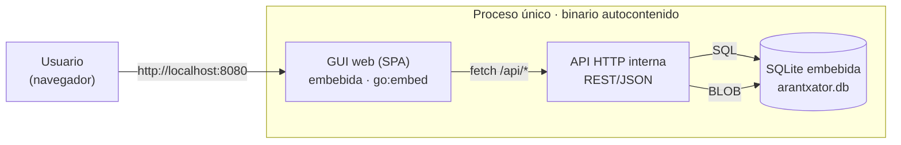
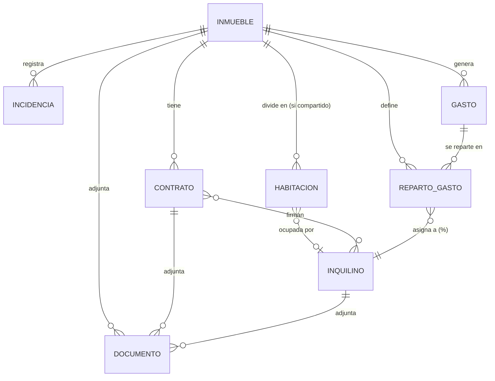

# Sistema de gestión integral de alquileres — Diseño técnico y funcional

**Arantxator Flat Admin** · v1.0 · 23 ago 2026 · mercado España, Comunidad de Madrid
**Estado:** decisiones cerradas y validadas por el propietario del proyecto.

## 1. Objetivo y alcance

Construir una herramienta visual, autocontenida y configurable para
gestionar de forma integral una cartera de inmuebles en alquiler: altas de
propiedades, inquilinos y contratos, seguimiento de incidencias, y control
de gastos con reparto proporcional en pisos compartidos.

## 2. Premisas de arquitectura

1. **Autocontenido:** todos los paquetes y dependencias van embebidos. Nada
   de instalar un servidor de base de datos, un runtime aparte o librerías
   del sistema a mano.
2. **GUI 100% web:** la interfaz se usa desde el navegador. Por debajo puede
   hablar con los componentes que haga falta, pero la interacción del
   usuario es siempre web.
3. **Todo operativo al arrancar:** un único arranque deja disponibles
   interfaz, lógica y datos, sin pasos de instalación adicionales ni
   servicios que levantar por separado.

## 3. Stack tecnológico

| Opción | Veredicto | Motivo |
|---|---|---|
| **Go** | ✅ elegida | Compila a un único binario nativo. Frontend compilado y SQLite embebida (sin CGO) viajan dentro del mismo ejecutable. Arranque instantáneo, sin runtime, huella mínima. |
| .NET 8 | alternativa viable | `dotnet publish --self-contained` también produce un único ejecutable, pero pesa bastante más (60–100 MB). |
| Node.js | descartada | Empaquetar Node en un ejecutable realmente autocontenido es frágil: los módulos nativos (driver SQLite) complican el bundling multiplataforma. |

**Decisión:** Go en el backend, sirviendo una SPA compilada y embebida con
`embed.FS`, más SQLite embebida (`modernc.org/sqlite`, driver puro Go) como
almacén de datos. Los documentos adjuntos se guardan como **BLOB dentro de
la propia base de datos** (ver §7).

*Un único ejecutable arranca los tres componentes en el mismo proceso: la
GUI ya compilada, la API que la sirve y resuelve las peticiones, y el
almacén de datos — incluidos los documentos, como BLOB en la misma base de
datos. No hay nada externo que instalar ni ningún otro servicio que
levantar.*

### 3.1 Instalación transparente para un usuario sin conocimientos técnicos

No hace falta descargar nada en el momento de instalar: el compilador mete
el frontend, el motor de base de datos y la lógica dentro del propio
ejecutable al compilar, no cuando el usuario lo instala. Eso simplifica el
instalador en vez de complicarlo, y evita el punto de fallo más habitual en
instaladores de apps técnicas — que a mitad de la instalación falle una
descarga por falta de conexión o de permisos.

Experiencia de instalación:

1. Se descarga un único instalador (`Arantxator-Setup.exe`, generado con
   Inno Setup).
2. Se ejecuta con doble clic; copia el programa y crea un icono en el
   escritorio — sin conexión a internet en este paso.
3. Al abrir el icono, la aplicación arranca en segundo plano y abre
   automáticamente el navegador por defecto en la pantalla principal. El
   usuario nunca ve una terminal ni un puerto.
4. Un icono en la bandeja del sistema permite cerrar el programa del todo.

## 4. Módulo: Inmuebles

### 4.1 Ficha del inmueble

| Campo | Detalle |
|---|---|
| Identificación | Dirección completa, referencia catastral, código postal, ciudad/provincia, coordenadas para mapa |
| Tipo | Piso, casa, habitación (alquiler por habitaciones), local |
| Características | m² construidos/útiles, nº habitaciones y baños, planta, ascensor, terraza, trastero, garaje, amueblado, año de construcción |
| Certificación energética | Letra y fecha de caducidad |
| Titularidad | Propietario(s); si hay varios, % de titularidad de cada uno |
| Estado operativo | Disponible / alquilado / en reforma / fuera de servicio |
| Compartido | Marca si el inmueble se alquila por habitaciones a varios inquilinos independientes en lugar de a un único arrendatario (o grupo con contrato conjunto). Activa el submódulo de habitaciones (§4.2) |
| Reparto de gastos | Configuración de % por inquilino (detalle en §7) |
| Suministros | Compañía, nº de contrato/CUPS y titular de luz, agua, gas e internet |
| Documentación | Escritura, cédula de habitabilidad, certificado energético, póliza de seguro del hogar, ITE/IEE si aplica |
| Fotos | Galería del inmueble |

### 4.2 Submódulo de habitaciones (inmuebles compartidos)

Cuando un inmueble se marca como **compartido**, se da de alta cada
habitación por separado, con su propia ficha, en lugar de tratar el piso
como una unidad indivisible. Esto permite llevar control individualizado
(qué habitación necesita mantenimiento, cuál está libre, quién ocupa cada
una) en vez de una única foto de "3 inquilinos" a nivel de piso.

| Campo | Detalle |
|---|---|
| Identificador | Nombre o número de la habitación (ej. "Habitación 1", "Doble exterior") |
| Características | m², baño propio (sí/no), amueblada, ventana exterior, notas libres |
| Ocupante | Inquilino que ocupa la habitación actualmente (opcional; se asigna desde la ficha del inquilino una vez existe el módulo de Inquilinos — Hito 2) |

La relación habitación–inquilino es 1:1 en un momento dado (una habitación
tiene como mucho un ocupante), pero es independiente del `Contrato`: un
contrato de piso compartido puede seguir vinculando varios inquilinos al
mismo `Inmueble` (§6); la habitación es la unidad de **control físico**
del espacio, no la unidad contractual. Qué contrato ocupa qué habitación
concretamente es una decisión pendiente de cerrar en el Hito 3 (ver
`docs/plan/plan-implementacion.md`).

### 4.3 Submódulo de incidencias

Cada inmueble mantiene su propio histórico de incidencias, con flujo de
estado y coste asociado.

| Campo | Detalle |
|---|---|
| Categoría | Fontanería, electricidad, electrodomésticos, estructura, plagas, cerrajería, otros |
| Prioridad | Baja / media / alta / urgente |
| Origen | Reportada por el inquilino o detectada por el propietario/gestor |
| Estado | Abierta → en proceso → a la espera de proveedor → resuelta → cerrada |
| Proveedor | Técnico/empresa asignada, con datos de contacto |
| Coste | Importe y a quién se imputa (propietario o inquilino) |
| Seguimiento | Fecha de apertura, timeline de comentarios, fecha de cierre |
| Adjuntos | Fotos del problema, factura del arreglo |

## 5. Módulo: Inquilinos

| Campo | Detalle |
|---|---|
| Datos personales | Nombre completo, DNI/NIE/pasaporte, fecha de nacimiento, teléfono, email, nacionalidad |
| Contacto de emergencia | Nombre, relación, teléfono |
| Datos de pago | IBAN para domiciliación de recibos |
| Solvencia | Justificante de ingresos/nómina, avalista, seguro de impago |
| Documentación | Copia de DNI/NIE, contrato laboral, aval |
| Histórico | Inmuebles ocupados en el tiempo, incidencias reportadas, historial de pagos |

Un contrato puede tener varios inquilinos (piso compartido con contrato
conjunto). El modelo trata Contrato–Inquilino como relación N:N.

## 6. Módulo: Contratos

Es el módulo con más carga normativa: duración, prórrogas, fianza y
actualización de renta siguen reglas concretas de la LAU, usadas como
valores por defecto que el usuario puede anular caso a caso.

> **LAU 2026 · Comunidad de Madrid**
> - **Duración mínima:** 5 años si el arrendador es persona física, 7 si es
>   persona jurídica.
> - **Prórroga tácita:** agotada la duración obligatoria, el contrato se
>   prorroga automáticamente año a año (art. 10 LAU) hasta un máximo de 3
>   años más, salvo preaviso — 4 meses el arrendador, 2 meses el inquilino.
> - **Fianza legal:** 1 mensualidad de renta en vivienda, 2 mensualidades en
>   uso distinto de vivienda.
> - **Depósito de la fianza (específico de Madrid):** el propietario debe
>   depositarla en la Agencia de Vivienda Social (antiguo IVIMA) en un
>   plazo de 30 días desde la firma; fuera de plazo hay recargo del 2%
>   (o 5% si ha pasado más de un año).
> - **Actualización de renta:** desde el 1 de enero de 2025 se referencia
>   al IRAV (Índice de Referencia de Actualización de la Vivienda, INE) en
>   lugar del IPC; el IRAV es siempre igual o inferior al IPC.
> - **Zonas de mercado tensionado:** la Comunidad de Madrid no las ha
>   declarado — de momento no aplican límites de subida por zona.

| Campo | Detalle |
|---|---|
| Datos del contrato | Fecha de firma, inicio, duración pactada, fin, tipo de persona arrendadora |
| Renovación | Alerta configurable X días antes del vencimiento; registro de prórroga tácita |
| Renta | Importe mensual, día de pago, forma de pago, índice de referencia, fecha de próxima revisión |
| Fianza | Importe, mensualidades, estado, fecha de depósito en la Agencia de Vivienda Social y alerta del plazo de 30 días |
| Garantías adicionales | Aval bancario, seguro de impago, depósito adicional |
| Cláusulas | Mascotas, subarriendo, uso permitido, condiciones particulares |
| Documento | PDF del contrato firmado, con versiones para anexos/prórrogas |
| Estado | Activo / próximo a vencer / vencido / rescindido anticipadamente (con motivo) |

## 7. Módulo: Gastos y reparto

El reparto porcentual no es un campo fijo del inmueble, porque cambia con
el tiempo (entran y salen inquilinos) y puede variar por tipo de gasto. Se
modela como una **entidad propia con vigencia**.

### 7.1 Registro de gastos

| Campo | Detalle |
|---|---|
| Tipo | Agua, luz, gas, internet/telefonía, comunidad, IBI, seguro del hogar, mantenimiento, basuras, gestoría, otros |
| Periodicidad | Mensual, bimestral, trimestral, anual — configurable por gasto |
| Factura | Importe, fecha de emisión y vencimiento, proveedor, PDF adjunto |
| Estado de pago | Pendiente / pagado / vencido, con fecha y método de pago |

### 7.2 Reparto en piso compartido

Se define un **% de reparto por inquilino y por tipo de gasto**, con fecha
de inicio de vigencia. Con eso, cada factura calcula automáticamente cuánto
debe cada inquilino y genera su recibo individual.

| Campo | Detalle |
|---|---|
| Reparto vigente | % asignado a cada inquilino activo, por tipo de gasto |
| Vigencia | Fecha desde–hasta (histórico versionado, no se sobrescribe) |
| Cálculo | Importe por inquilino = importe de la factura × % vigente en la fecha de la factura |
| Recibo individual | Desglose por inquilino de lo que debe de cada gasto del periodo |

### 7.3 Cobros de renta y rentabilidad

El cobro mensual de renta se registra junto a los gastos para poder
calcular, por inmueble: ingresos (rentas cobradas) − gastos = rentabilidad
neta. Exportable a Excel/PDF, útil de cara a la declaración de la renta.

## 8. Funcionalidades transversales

- **Dashboard general:** ocupación de la cartera, incidencias abiertas,
  contratos por vencer, gastos pendientes, rentabilidad agregada.
- **Centro de notificaciones:** icono con contador de avisos activos
  (contrato por vencer, factura pendiente, incidencia sin resolver, fianza
  sin depositar). Al arrancar la aplicación, si hay algo que requiera
  atención se muestra un aviso resumen antes del dashboard. Solo dentro de
  la app — sin email/SMTP.
- **Acceso:** aplicación mono-usuario de uso local, sin roles ni permisos.
  Queda abierto para más adelante añadir un PIN de acceso, no necesario
  para el MVP.
- **Copia de seguridad:** al vivir todo (datos + documentos) en SQLite, un
  backup es copiar un único fichero — automatizable desde la propia app.

## 9. Modelo de datos

`RepartoGasto` vive fuera de `Inmueble` precisamente para poder tener
varios repartos vigentes en distintos periodos. `Documento` es una tabla
polimórfica (por `entidad_tipo` + `entidad_id`) que guarda el contenido
como BLOB, referenciable desde Inmueble, Inquilino, Contrato, Gasto o
Incidencia. `Habitacion` solo tiene sentido cuando `Inmueble.compartido`
es verdadero (§4.2); su vínculo con `Inquilino` es opcional y de
presentación (quién ocupa hoy cada habitación), no la relación
contractual, que sigue siendo `Contrato` ↔ `Inquilino`.

El esquema SQL inicial vive en
[`internal/storage/sqlite/migrations/0001_init_schema.sql`](../../internal/storage/sqlite/migrations/0001_init_schema.sql)
y los tipos Go correspondientes en
[`internal/domain/`](../../internal/domain/).

## 10. MVP y fases

| | Incluye |
|---|---|
| **MVP** | Inmuebles (ficha + documentación), Inquilinos, Contratos (con alertas de vencimiento), Gastos con reparto porcentual e histórico, Incidencias, dashboard y centro de notificaciones |
| **Fase 2** | Exportación fiscal avanzada, notificaciones por email, directorio de proveedores reutilizable, adjuntos con firma digital |

## 11. Decisiones confirmadas

Todas las preguntas abiertas de la v0.1 quedaron resueltas el 23/08/2026:

- **Stack:** Go + SQLite embebida + SPA, instalador nativo de Windows sin
  descargas en el momento de instalar.
- **Usuarios:** mono-usuario, sin roles.
- **Notificaciones:** solo en la app, con aviso al arrancar y centro de
  notificaciones.
- **Alcance:** mono-cartera — una persona, sus inmuebles, inquilinos y
  contratos.
- **Documentos:** BLOB dentro de SQLite (no ficheros en disco) — copia de
  seguridad = un único fichero, sin riesgo de que un documento quede
  huérfano si falla un borrado a medias.

## 12. Próximos pasos

1. `go mod tidy` para fijar la dependencia de SQLite.
2. **Mockups de la GUI** — pantalla por pantalla, con dirección visual
   limpia, colorida y minimalista. Paso obligatorio antes de picar código
   de interfaz; todavía no iniciado.
3. Módulo de Inmuebles end-to-end (API + GUI) como primera vertical
   completa, en su propia rama con PR hacia `development`.
