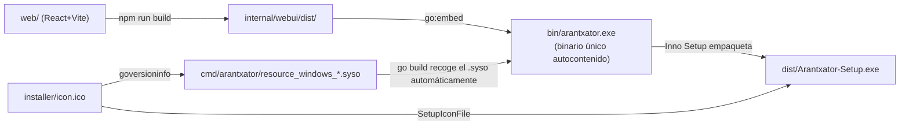

# Instalación y despliegue

**Arantxator Flat Admin** · Hito 7 — Empaquetado e instalador · 23 ago 2026

Este documento detalla, paso a paso, cómo se genera el instalador de
Windows (`Arantxator-Setup.exe`) a partir del código fuente, y cómo lo
usa un usuario final sin conocimientos técnicos. Complementa
[`docs/design/diseno-tecnico-funcional.md`](../design/diseno-tecnico-funcional.md)
(sección "Instalación transparente") y el
[Hito 7 del plan de implementación](../plan/plan-implementacion.md#hito-7--empaquetado-e-instalador).

> **Nota de secuencia:** este hito se ha adelantado respecto al orden original
> del plan (que lo dejaba para el final, tras los hitos 2–6) porque así lo
> pidió el propietario del proyecto: cerrar el empaquetado ahora, con el
> módulo de Inmuebles ya construido, en vez de esperar a tener toda la
> v1.0-alpha funcional. La checklist manual de "hitos anteriores" de la
> batería de este hito, por tanto, cubre hoy solo el Hito 1 — se repetirá de
> forma acumulativa según se vayan cerrando los hitos 2–6.

## 1. Arquitectura del empaquetado



Tres capas, cada una empaquetada dentro de la siguiente:

1. **La SPA** se compila con Vite y su resultado estático se copia a
   `internal/webui/dist/`.
2. **El binario Go** (`bin/arantxator.exe`) incluye esa SPA con `go:embed`,
   más el motor SQLite (driver puro Go, sin CGO) y toda la lógica de la
   API. Es un único `.exe` que no depende de nada más — ver
   [`internal/webui/embed.go`](../../internal/webui/embed.go) y
   [`cmd/arantxator/main.go`](../../cmd/arantxator/main.go).
3. **El instalador** (`dist/Arantxator-Setup.exe`), generado con
   [Inno Setup](https://jrsoftware.org/isinfo.php), simplemente copia ese
   `.exe` al equipo del usuario y crea los accesos directos — no descarga
   nada durante la instalación, porque no hay nada que descargar.

## 2. Requisitos para compilar desde el código fuente

| Herramienta | Uso | Instalación |
|---|---|---|
| [Go](https://go.dev/dl/) 1.23+ | Compila el backend | ya instalado en esta máquina |
| [Node.js](https://nodejs.org/) LTS | Compila la SPA | ya instalado en esta máquina |
| [Inno Setup 6](https://jrsoftware.org/isinfo.php) | Genera el instalador `.exe` | `winget install JRSoftware.InnoSetup` |
| [goversioninfo](https://github.com/josephspurrier/goversioninfo) | Incrusta icono y versión en el `.exe` (solo si cambia el icono/versión) | `go install github.com/josephspurrier/goversioninfo/cmd/goversioninfo@latest` |

Inno Setup y goversioninfo **no son necesarios en una máquina que solo
compila el binario Go** (`go build` ya recoge los ficheros
`cmd/arantxator/resource_windows_*.syso` que van versionados en el
repositorio, con el icono y la versión ya incrustados). Solo hacen falta
si vas a **generar el instalador** o **regenerar el icono/versión**.

## 3. Compilar todo con un comando

```powershell
powershell -File scripts/build.ps1
```

Este script (ver [`scripts/build.ps1`](../../scripts/build.ps1)) encadena:

1. `npm install` + `npm run build` en `web/` → deja el resultado en
   `internal/webui/dist/`.
2. `go build -o bin/arantxator.exe ./cmd/arantxator` → el binario final,
   con el icono y la versión ya incrustados (vienen de los `.syso`
   versionados, no hace falta goversioninfo para este paso).
3. Si encuentra Inno Setup instalado (`ISCC.exe`, busca primero en el
   `PATH` y si no en las rutas típicas de instalación), compila
   `installer/setup.iss` → genera `dist/Arantxator-Setup.exe`. Si no lo
   encuentra, avisa y omite este paso sin fallar (el binario sigue siendo
   utilizable con `go run`/`bin/arantxator.exe` para desarrollo).

### 3.1 Publicar el instalador en una release

`dist/` está en `.gitignore` (es un artefacto de build), así que el instalador
no se versiona: se **adjunta como asset a la release de GitHub** de esa versión.
Tras `build.ps1`:

```bash
gh release upload <tag> dist/Arantxator-Setup.exe
```

Así queda descargable en
`https://github.com/naparito/Arantxator-flat-admin/releases/download/<tag>/Arantxator-Setup.exe`
y en la [página de releases](https://github.com/naparito/Arantxator-flat-admin/releases).
La **v1.0-alpha** ya tiene su `Arantxator-Setup.exe` publicado de esta forma.

## 4. El icono de la aplicación

`installer/icon.ico` es el isotipo de la marca (el mismo glifo de casa del
rail de navegación de la SPA, ver
[`web/src/components/Sidebar.tsx`](../../web/src/components/Sidebar.tsx))
en cuatro resoluciones (16, 32, 48 y 256 px), sobre el fondo oscuro de
marca (`--sidebar-bg`).

Se genera dibujándolo directamente con `System.Drawing` (sin depender de
un conversor SVG→ICO externo) desde
[`scripts/generate-icon.ps1`](../../scripts/generate-icon.ps1):

```powershell
powershell -File scripts/generate-icon.ps1
```

Solo hace falta volver a ejecutarlo si cambia el isotipo de la marca.

### Cómo llega el icono al `.exe`

`go build` en Windows recoge automáticamente cualquier fichero
`.syso` que encuentre en el paquete que compila — es un comportamiento
nativo del compilador, sin flags especiales. `goversioninfo` genera esos
`.syso` (uno por arquitectura: `resource_windows_amd64.syso`,
`_386`, `_arm`, `_arm64`) a partir de:

- `installer/icon.ico` — el icono.
- [`cmd/arantxator/versioninfo.json`](../../cmd/arantxator/versioninfo.json) — nombre, versión y copyright que
  se ven en las Propiedades del fichero en el Explorador de Windows.

Esos `.syso` **se versionan en el repositorio** (no van en `.gitignore`)
precisamente para que un `go build` limpio, en una máquina que no tiene
`goversioninfo` instalado, ya produzca un `.exe` con icono. Si cambias el
icono o `versioninfo.json`, regenéralos con:

```powershell
powershell -File scripts/generate-versioninfo.ps1
```

y confirma el cambio de los `.syso` en el commit correspondiente.

## 5. El script de Inno Setup

[`installer/setup.iss`](../../installer/setup.iss) define el instalador.
Puntos relevantes:

- **`PrivilegesRequired=lowest`** — se instala en el perfil del propio
  usuario (`%LOCALAPPDATA%\Programs\Arantxator Flat Admin`), sin pedir
  permisos de administrador. Encaja con el perfil "un usuario sin
  conocimientos técnicos": no hay UAC que aceptar.
- **`[Files]`** — copia únicamente `bin/arantxator.exe`. Nada más: la SPA,
  SQLite y toda la lógica ya viajan dentro de ese único fichero.
- **`[Icons]`** — crea el acceso directo del menú Inicio siempre, y el del
  escritorio si el usuario deja marcada la casilla del asistente (tarea
  `desktopicon`, marcada por defecto).
- **`[Run]`** — al terminar el asistente, ofrece abrir la aplicación
  directamente.
- **Compresión LZMA2** — el instalador resultante pesa ~10-11 MB.
- **Sin `[Code]`/descargas** — Inno Setup empaqueta todo dentro del propio
  `.exe` del instalador; no hay ninguna llamada de red durante la
  instalación.

Compilación manual (si no quieres pasar por `build.ps1`):

```powershell
& "$env:LOCALAPPDATA\Programs\Inno Setup 6\ISCC.exe" installer\setup.iss
```

El resultado se deja en `dist/Arantxator-Setup.exe` (carpeta
`.gitignore`d — es un artefacto de build, no se versiona).

## 6. Qué ve el usuario final

1. Descarga `Arantxator-Setup.exe` (un único fichero, ~11 MB) desde la
   [página de releases del repositorio](https://github.com/naparito/Arantxator-flat-admin/releases/latest).
   Cada release de GitHub lleva el `.exe` adjunto como asset (se sube tras
   generarlo con `build.ps1`, ver §3 y §7); `dist/` sigue estando en
   `.gitignore`, así que el instalador **no** se versiona en el árbol de código,
   solo se publica en la release. Para un equipo sin acceso a GitHub, basta con
   copiar ese único fichero por USB / red / correo.
2. Doble clic. El asistente (en español) pregunta si crear el acceso
   directo del escritorio y dónde instalar — sin conexión a internet en
   ningún paso, sin pedir contraseña de administrador.
3. Al terminar, puede abrir la aplicación directamente desde el propio
   asistente, o luego desde el icono del escritorio / menú Inicio.
4. Al abrirla, arranca el servidor en segundo plano y el navegador por
   defecto se abre solo en `http://127.0.0.1:8080` — sin terminales ni
   puertos que el usuario tenga que ver o configurar (ver
   [`cmd/arantxator/main.go`](../../cmd/arantxator/main.go), función
   `openBrowser`).
5. Los datos (`arantxator.db`, con todos los documentos incluidos como
   BLOB) se guardan junto al ejecutable, en
   `%LOCALAPPDATA%\Programs\Arantxator Flat Admin\arantxator.db`.

### Copia de seguridad

Cerrar la aplicación y copiar `arantxator.db` a otro sitio (otro disco, la
nube, un USB) **es la copia de seguridad completa** — datos y documentos
incluidos, porque todo vive en ese único fichero SQLite. Restaurar es
copiar ese fichero de vuelta a la carpeta de instalación (o apuntar
`ARANTXATOR_DB_PATH` a él).

### Desinstalar

Desde "Aplicaciones instaladas" del Panel de control / Configuración de
Windows, como cualquier otro programa (Inno Setup registra el
desinstalador estándar). Esto elimina el ejecutable, los accesos directos
y las entradas de registro — **pero no borra `arantxator.db`**: Inno
Setup, por diseño, nunca borra ficheros que no instaló él mismo, así que
los datos del usuario sobreviven a una desinstalación por error. Si el
usuario quiere una limpieza total, tiene que borrar a mano la carpeta
`%LOCALAPPDATA%\Programs\Arantxator Flat Admin` (que a esas alturas solo
contiene el `.db`).

## 7. Verificación realizada

Antes de cerrar este hito se ha probado el ciclo completo en esta misma
máquina (instalación real, no solo la compilación):

- `powershell -File scripts/build.ps1` de principio a fin, sin pasos
  manuales adicionales → genera `bin/arantxator.exe` y
  `dist/Arantxator-Setup.exe`.
- El `.exe` resultante lleva el icono y los metadatos de versión
  correctos (comprobado extrayendo el icono y leyendo
  `(Get-Item ...).VersionInfo`).
- Instalación silenciosa (`Arantxator-Setup.exe /SILENT /TASKS=desktopicon`)
  → crea el acceso directo del escritorio, la entrada del menú Inicio y la
  clave de desinstalación; el log no reporta errores.
- La aplicación instalada arranca (`/api/health` responde `ok`) y la GUI
  carga igual que en desarrollo, sin errores en consola.
- Desinstalación silenciosa (`unins000.exe /SILENT`) → borra el `.exe`,
  los accesos directos y la clave de registro; deja deliberadamente
  `arantxator.db`, tal como se documenta arriba. No quedan procesos
  colgados.

Pendiente (no verificable desde este entorno de desarrollo): la prueba en
una **máquina Windows realmente limpia** (sin Go/Node/Git instalados), que
pide explícitamente la batería del Hito 7. Lo hecho aquí prueba que el
instalador construye y funciona correctamente en una instalación real de
usuario (perfil sin privilegios, sin usar ningún `go run`/`npm run dev` de
desarrollo) — la única variable no cubierta es la ausencia total de
herramientas de desarrollo en el equipo, que no se puede simular sin una
VM o un segundo equipo físico.

## 8. Solución de problemas

| Síntoma | Causa probable | Solución |
|---|---|---|
| `build.ps1` se salta el instalador ("Inno Setup no está instalado") | Falta Inno Setup | `winget install JRSoftware.InnoSetup` y repetir |
| El `.exe` no lleva el icono nuevo tras cambiarlo | Los `.syso` no se regeneraron | `powershell -File scripts/generate-versioninfo.ps1` y volver a compilar |
| El instalador pide permisos de administrador | No debería — revisar que `PrivilegesRequired=lowest` sigue en `installer/setup.iss` | — |
| Tras desinstalar, sigue viva una carpeta con solo `arantxator.db` | Comportamiento esperado (ver §6) | Borrar la carpeta a mano si se quiere limpieza total, o conservarla como copia de seguridad |
| La app no arranca tras instalar en una máquina realmente limpia | Puerto `8080` ocupado por otro proceso | Fijar `ARANTXATOR_ADDR` como variable de entorno antes de abrir el `.exe` |
| En desarrollo, los datos "desaparecen" cada vez que se arranca la app | Se está usando `go run`, que compila un binario temporal en una carpeta distinta cada vez, y `arantxator.db` se guarda junto al ejecutable en marcha | Fijar `ARANTXATOR_DB_PATH` a una ruta fija antes de `go run` (ver [`docs/plan/plan-implementacion.md`](../plan/plan-implementacion.md#durante-el-desarrollo-hitos-16-cómo-probar-cada-módulo)), o compilar una vez con `go build -o bin/arantxator.exe ./cmd/arantxator` y ejecutar siempre ese mismo `.exe` |
