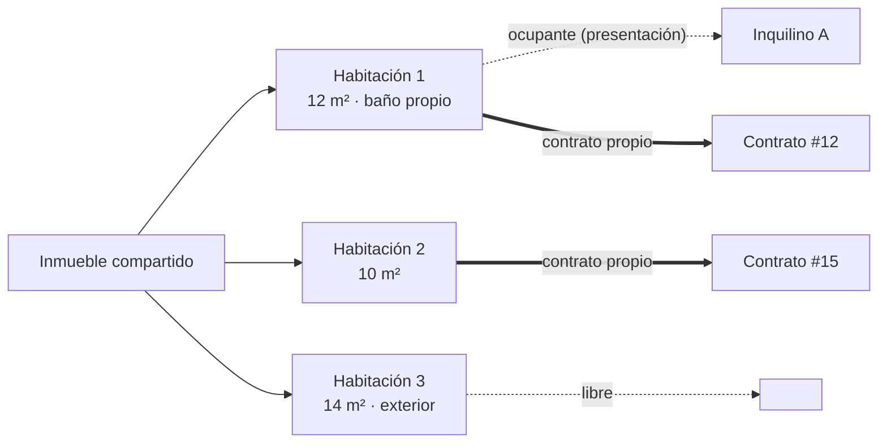

# 1 · Inmuebles

> Ficha de cada propiedad de la cartera: identificación, características,
> certificado energético, estado operativo, suministros y documentación.
> Si el inmueble es **compartido**, además gestiona sus habitaciones.
> Los submódulos [Incidencias](04-incidencias.md) y
> [Gastos](05-gastos-y-reparto.md) cuelgan de aquí.

## Conceptos clave

| Concepto | Detalle |
|---|---|
| **Tipo** | `piso`, `casa`, `habitacion`, `local`. |
| **Estado operativo** | `disponible`, `alquilado`, `en_reforma`, `fuera_de_servicio`. En un inmueble **no compartido** lo mueve el contrato automáticamente (activar → `alquilado`, rescindir → `disponible`); en uno **compartido** lo fija el usuario a mano. |
| **Compartido** | Si se marca, el inmueble se alquila por habitaciones. Aparece el tab **Habitaciones** y el % de ocupación; el `Estado` deja de ser automático. |
| **% de ocupación** | Solo en compartidos. Dato derivado: `habitaciones con contrato vigente ÷ total de habitaciones` (p. ej. `2/3 · 67 %`). No se guarda. |
| **Suministros** | Luz, agua, gas, internet — compañía, nº de contrato/CUPS y titular de cada uno. |
| **Documentación** | Escritura, cédula, certificado energético, seguro, fotos… como BLOB en la base de datos. |

## Pantallas

### Listado — `/inmuebles`

```
┌ Inmuebles ─────────────────────────────────────────────────┐
│ [Todos·5] [Alquilados·2] [Disponibles·1] [En reforma·1] …  │  ← filtro por estado
│                                          [ + Nuevo inmueble ]│
├────────────────────────────────────────────────────────────┤
│  ┌──────────────┐  ┌──────────────┐  ┌──────────────┐       │
│  │ Alquilado    │  │ Vence 12 d.  │  │ Disponible   │  …    │  ← tarjeta por inmueble
│  │ Alcalá 145   │  │ Bravo M. 210 │  │ Avda Amér. 12│       │
│  │ Piso·Salaman.│  │ Compart.·67 %│  │ Piso·Chamart.│       │
│  └──────────────┘  └──────────────┘  └──────────────┘       │
└────────────────────────────────────────────────────────────┘
```

1. Filtra por estado con los chips de arriba (el contador de cada chip es en vivo).
2. Cada tarjeta muestra dirección, tipo/zona y una **pill de estado**; en los
   compartidos, la pill es el % de ocupación.
3. **Nuevo inmueble** abre el formulario de alta.
4. Clic en una tarjeta → **Ficha**.

### Alta / edición — `/inmuebles/nuevo` y `/inmuebles/:id/editar`

Formulario con los campos de la ficha. Reglas de validación:

- **Obligatorios:** `nombre`, `direccion`, `tipo` (uno de los 4 válidos).
- Un `tipo` o `estado` fuera de la lista → error `400` (no un `500` genérico).
- La casilla **«Compartido»** activa/desactiva el submódulo de habitaciones.
- Al guardar, se vuelve a la ficha y los cambios persisten tras reiniciar la app.

### Ficha — `/inmuebles/:id`

Cabecera con dirección, estado y acciones (**Editar**, **Nueva incidencia**), y
cinco tabs:

| Tab | Contenido | Notas |
|---|---|---|
| **Datos generales** | Todos los campos de la ficha en modo lectura. | |
| **Documentación** | Lista de adjuntos + zona de subida. | Descarga byte a byte idéntica al original; admite ficheros de varios MB. |
| **Suministros** | Tarjeta por suministro (luz/agua/gas/internet), editable en línea. | |
| **Habitaciones** | Solo si el inmueble es **compartido** (ver más abajo). | No aparece en inmuebles normales. |
| **Incidencias** | Submódulo completo — ver [módulo 4](04-incidencias.md). | El badge del tab cuenta las incidencias abiertas. |

## Submódulo Habitaciones (inmuebles compartidos)



- Cada habitación tiene: **nombre**, m², baño propio (sí/no), amueblada, notas.
- **Ocupante**: inquilino que vive hoy ahí. Es un dato **de presentación**
  (`PUT /api/habitaciones/{id}/ocupante`), independiente del contrato. Se asigna
  desde el selector de la ficha de la habitación; solo lista inquilinos que no
  ocupan ya otra habitación del mismo inmueble.
- Quitar el ocupante = enviar `inquilinoId: null` (la habitación queda libre sin
  borrar nada).
- **Borrado en cascada:** borrar el inmueble borra sus habitaciones (no quedan
  huérfanas). Borrar un inquilino que solo *ocupa* una habitación la deja sin
  ocupante, no bloquea el borrado (a diferencia de un contrato vigente, que sí lo
  bloquea — ver [módulo 3](03-contratos.md)).

## Reglas de negocio

| Regla | Comportamiento |
|---|---|
| Alta mínima | Con solo `nombre` + `direccion` + `tipo`, los opcionales quedan nulos/por defecto, sin error. |
| Edición | Los cambios persisten y `actualizadoEn` se refresca. |
| Estado automático (no compartido) | Contrato activo → `alquilado`; contrato rescindido → `disponible`. |
| Estado manual (compartido) | Nunca se toca solo; lo fija el usuario (`disponible` por defecto, o `en_reforma`/`fuera_de_servicio`). |
| % de ocupación | `round(habitaciones con contrato vigente / total × 100)`. 2 de 3 → **67 %** exacto. |
| Documento | Contenido recuperado idéntico byte a byte; ficheros de varios MB no se truncan. |

## API

| Método y ruta | Cuerpo (campos relevantes) | Respuesta | Errores |
|---|---|---|---|
| `GET /api/inmuebles?estado=` | — | `Inmueble[]` (con `ocupacion` si es compartido) | `400` si `estado` no válido |
| `POST /api/inmuebles` | `nombre*`, `direccion*`, `tipo*`, `compartido`, `estado`, características, `suministros` | `201` + `Inmueble` | `400` campo obligatorio ausente / valor fuera de lista |
| `GET /api/inmuebles/{id}` | — | `Inmueble` | `404` |
| `PUT /api/inmuebles/{id}` | igual que el alta | `Inmueble` | `400`, `404` |
| `POST /api/inmuebles/{id}/documentos` | `multipart/form-data`, campo `archivo` | `201` + `Documento` | `404` |
| `GET /api/inmuebles/{id}/documentos` | — | `Documento[]` | `404` |
| `GET /api/documentos/{id}` | — | el fichero (bytes originales) | `404` |
| `GET /api/inmuebles/{id}/habitaciones` | — | `Habitacion[]` | `404` inmueble inexistente |
| `POST /api/inmuebles/{id}/habitaciones` | `nombre*`, `m2`, `tieneBano`, `amueblada`, `notas` | `201` + `Habitacion` | `400`, `404` |
| `GET·PUT·DELETE /api/habitaciones/{id}` | (PUT: campos de la habitación) | `Habitacion` / `204` | `404` |
| `PUT /api/habitaciones/{id}/ocupante` | `{ "inquilinoId": 3 }` o `{ "inquilinoId": null }` | `Habitacion` | `400` si el inquilino ya ocupa otra habitación del inmueble |

`* = obligatorio`

## Preguntas frecuentes

- **¿Puedo pasar un inmueble de compartido a no compartido con habitaciones ya
  creadas?** Sí, pero deja de mostrarse el tab; las habitaciones siguen en la
  base de datos. Vuelve a marcar «Compartido» para verlas.
- **¿El % de ocupación cuenta contratos "próximos a vencer"?** Sí: cuenta todo
  contrato **vigente** (activo o próximo a vencer), no los vencidos ni
  rescindidos.
