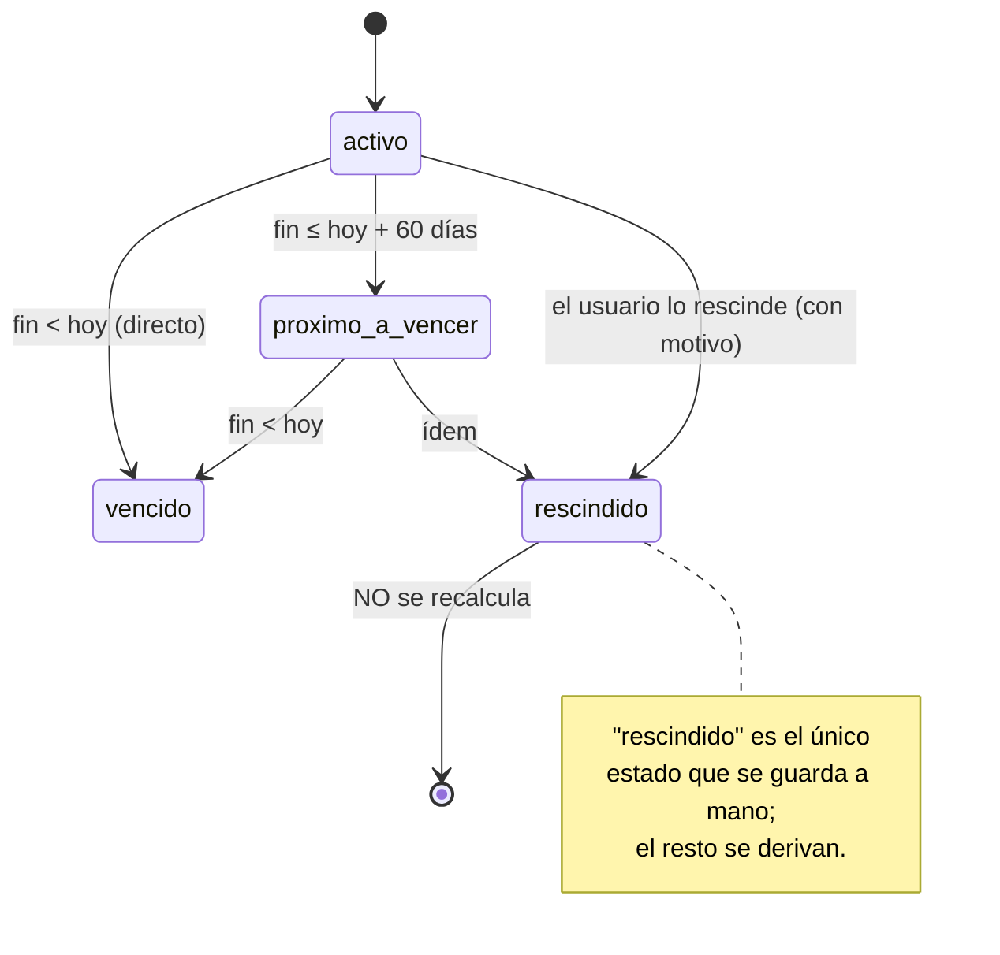
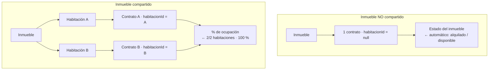

# 3 · Contratos

> Arrendamientos que vinculan un inmueble (o una habitación concreta, si es
> compartido) con uno o varios inquilinos. Aplica por defecto las reglas de la
> **LAU para la Comunidad de Madrid**, que el usuario puede anular caso a caso.
> El **estado** del contrato no se marca a mano: se deriva de las fechas.

## Reglas de la LAU aplicadas (valores por defecto)

| Regla | Valor |
|---|---|
| **Duración mínima** | 5 años si el arrendador es **persona física**, 7 si es **persona jurídica**. |
| **Fecha de fin sugerida** | `fecha de firma + duración mínima` (editable). |
| **Fianza legal** | 1 mensualidad de renta (vivienda). |
| **Plazo de depósito de la fianza** | 30 días naturales desde la firma, en la **Agencia de Vivienda Social**. |
| **Fecha límite de depósito** (derivada) | `fecha de firma + 30 días`, exacta. |
| **Índice de actualización** | `IRAV` por defecto. |
| **Ventana de aviso de vencimiento** | 60 días naturales antes del fin. |

## Estado del contrato (derivado)

Se recalcula **cada vez que se lee**, a partir de la fecha de fin y de hoy:



| Estado | Cuándo | ¿Ocupa su ámbito? (`vigente`) |
|---|---|---|
| `activo` | Fin a más de 60 días | Sí |
| `proximo_a_vencer` | Fin dentro de los próximos 60 días (incl. el día 60) | Sí |
| `vencido` | La fecha de fin ya pasó | No |
| `rescindido` | Marcado a mano, con `motivoBaja` | No |

## Contrato de inmueble vs. contrato de habitación



- **No compartido:** `habitacionId` debe ser **nulo**. Activar un contrato pone
  el inmueble en `alquilado`; rescindirlo, en `disponible`.
- **Compartido:** `habitacionId` es **obligatorio** y debe ser una habitación de
  ese inmueble. El `Estado` del inmueble **no se toca**; sube el % de ocupación.
- **No solapamiento:** no puede haber dos contratos vigentes sobre el mismo
  **ámbito** — el inmueble (no compartido) o la habitación (compartido). Un
  inmueble compartido sí puede tener varios contratos vigentes a la vez, uno por
  habitación.

## Pantallas

### Listado — `/contratos`

```
┌ Contratos ─────────────────────────────────────────────────┐
│ [Todos·4] [Activos·2] [Por vencer·1] [Finalizados·1]        │
│                                          [ + Nuevo contrato ]│
├───────────┬────────────┬────────┬───────────┬──────────────┤
│ Inmueble  │ Vigencia   │ Renta  │ Fianza    │ Estado       │
│ Alcalá 145│ 01/02/26 – │ 980 €  │ ⚠ Pend.   │ ● Activo     │
│  Laura F. │  31/01/31  │ /mes   │  quedan 8d│              │
│ Bravo M.  │ 15/03/26 – │ 620 €  │ ✓ Deposit.│ ● Próx.vencer│
│  · Hab. 1 │  15/10/26  │ /mes   │           │              │
└───────────┴────────────┴────────┴───────────┴──────────────┘
```

Filtro por estado; cada fila enlaza a la ficha. La columna **Fianza** muestra,
si está pendiente, los días que quedan (o el retraso) hasta la fecha límite.

### Alta / edición — `/contratos/nuevo` y `/contratos/:id/editar`

1. Elige el **inmueble**. Si es compartido, aparece el selector de **habitación**
   y el formulario **no deja guardar sin elegirla**.
2. Marca si el arrendador es persona física o jurídica → el formulario **rellena
   la duración y la fianza sugeridas**, que puedes sobrescribir.
3. Selecciona uno o varios **co-arrendatarios**.
4. Rellena fechas (firma, inicio, fin), renta mensual y día de pago.
5. Guardar. El backend valida (ver tabla de reglas) y calcula la fecha límite de
   la fianza.

Para **rescindir**: editar el contrato, poner estado `rescindido` y un
`motivoBaja`. En un inmueble no compartido, eso devuelve el inmueble a
`disponible`.

### Ficha — `/contratos/:id`

| Panel | Contenido |
|---|---|
| **Datos del contrato** | Inmueble/habitación, fechas, tipo de arrendador, duración. |
| **Renta y actualización** | Importe, día de pago, índice (IRAV), próxima revisión. |
| **Co-arrendatarios** | Inquilinos vinculados (enlazan a su ficha). |
| **Fianza** | Importe destacado, estado y, si está pendiente, el **aviso con la fecha límite** de depósito en la Agencia de Vivienda Social (igual que el mockup). |
| **Rescisión anticipada** | Visible solo si el contrato está rescindido: motivo y fecha. |
| **Documento** | PDF del contrato firmado y anexos (adjuntos BLOB). |

## Reglas de negocio (validación)

| Situación | Resultado |
|---|---|
| Falta `inmuebleId`, `fechaFirma`, `fechaInicio` o `fechaFin` | `400` |
| `inquilinoIds` vacío | `400` — un contrato necesita al menos un co-arrendatario |
| `fechaFin` no posterior a `fechaInicio` | `400` |
| `rentaMensual` ≤ 0 | `400` |
| `fianzaEstado` / `estado` fuera de la lista válida | `400` |
| Inmueble compartido sin `habitacionId` | `400` — hay que elegir la habitación |
| Inmueble no compartido con `habitacionId` | `400` — no puede ir asociado a una habitación |
| `habitacionId` de otra vivienda / inexistente | `400` |
| Segundo contrato vigente sobre el mismo ámbito | `409` — "esa habitación / ese inmueble ya tiene un contrato vigente" |
| Borrar un inquilino con contrato vigente | `409` (bloqueado por `ON DELETE RESTRICT`) |
| Contrato con 3 inquilinos | Los 3 quedan vinculados y el histórico de cada uno se actualiza |

Valores derivados en la respuesta: `estado`, `fechaLimiteDepositoFianza`.

## API

| Método y ruta | Cuerpo (campos relevantes) | Respuesta | Errores |
|---|---|---|---|
| `GET /api/contratos` | — | `Contrato[]` | — |
| `POST /api/contratos` | `inmuebleId*`, `habitacionId` (según compartido), `inquilinoIds*`, `fechaFirma*`, `fechaInicio*`, `fechaFin*`, `rentaMensual*`, `diaPago`, `arrendadorPersonaJuridica`, `fianzaImporte`, `fianzaEstado`, `indiceActualizacion`, `proximaRevisionRenta` | `201` + `Contrato` | `400`, `409` |
| `GET /api/contratos/{id}` | — | `Contrato` (con `estado` y `fechaLimiteDepositoFianza` derivados, `inquilinoIds`) | `404` |
| `PUT /api/contratos/{id}` | igual que el alta (+ `estado: "rescindido"`, `motivoBaja` para rescindir) | `Contrato` | `400`, `404`, `409` |
| `POST /api/contratos/{id}/documentos` | `multipart/form-data`, campo `archivo` | `201` + `Documento` | `404` |
| `GET /api/contratos/{id}/documentos` | — | `Documento[]` | `404` |

`* = obligatorio`

## Preguntas frecuentes

- **¿Cómo "renuevo" un contrato próximo a vencer?** Edita la `fechaFin` (o crea un
  contrato nuevo). Al alejar la fecha de fin más de 60 días, el estado vuelve a
  `activo` en la siguiente lectura; el aviso del centro de notificaciones deja de
  aparecer solo.
- **¿Un contrato "próximo a vencer" bloquea crear otro en la misma habitación?**
  Sí: sigue estando *vigente*. Solo un contrato `vencido` o `rescindido` libera el
  ámbito.
- **¿La fecha límite de la fianza cambia si edito la firma?** Sí, siempre es
  `firma + 30 días`, recalculada al leer.
