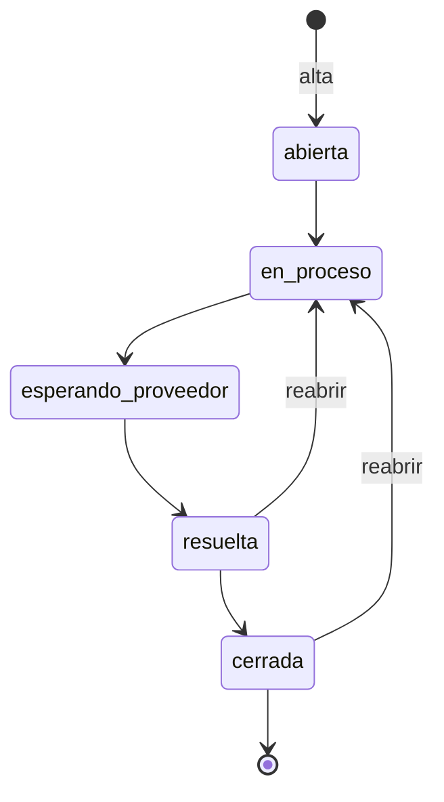

# 4 · Incidencias

> Submódulo de [Inmuebles](01-inmuebles.md): partes de mantenimiento de cada
> propiedad, con categoría, prioridad, proveedor asignado, coste y un **flujo de
> estados fechado**. Se gestiona desde el tab **Incidencias** de la ficha del
> inmueble.

## Conceptos clave

| Campo | Valores |
|---|---|
| **Categoría** | `fontaneria`, `electricidad`, `electrodomesticos`, `estructura`, `plagas`, `cerrajeria`, `otros`. |
| **Prioridad** | `baja`, `media` (por defecto), `alta`, `urgente`. |
| **Origen** | `inquilino` o `propietario` (opcional). |
| **Coste a cargo de** | `propietario` o `inquilino` (opcional). |
| **Estado** | `abierta` → `en_proceso` → `esperando_proveedor` → `resuelta` → `cerrada`. |
| **Historial** | Cada alta, cambio de estado y comentario queda registrado con su fecha. |

## Flujo de estados



- Se avanza **exactamente un paso** cada vez (no se saltan estados).
- Desde `resuelta` o `cerrada` se puede **reabrir** volviendo a `en_proceso`.
- Cualquier otra transición → `409` ("transición de estado no permitida").
- Al llegar a `cerrada` se sella la **fecha de cierre**; al reabrir, se limpia.
- **Contador del tab:** cuenta las incidencias que **no están `cerrada`** (por
  eso una `resuelta` sigue contando: trabajo hecho, pendiente de cierre
  administrativo).

## Pantallas

### Tab Incidencias — dentro de `/inmuebles/:id`

```
┌ Incidencias  (badge: 2 abiertas) ──────────────────────────┐
│                                       [ + Nueva incidencia ]│
├────────────────────────────────────────────────────────────┤
│ ⚠ Fuga en el grifo de la cocina        [alta] [en proceso] │
│   Fontanería · reportada por inquilino · 12/08/2026         │
│   Fontanería Hermanos Ruiz · 120 € a cargo del propietario  │
│   [ Cambiar estado ▾ ]  [ + comentario ]                    │
│   · 12/08 alta                                              │
│   · 13/08 abierta → en proceso                              │
├────────────────────────────────────────────────────────────┤
│ … siguiente incidencia …                                    │
└────────────────────────────────────────────────────────────┘
```

1. **Nueva incidencia**: título y categoría son obligatorios; la prioridad por
   defecto es `media`.
2. **Cambiar estado**: el selector solo ofrece las transiciones válidas desde el
   estado actual. Cada cambio queda fechado en el historial.
3. **+ comentario**: añade una nota al historial sin cambiar el estado.
4. **Adjuntos**: fotos del problema y factura del arreglo, con el mismo mecanismo
   BLOB que el resto de módulos.
5. Las **pills** de prioridad y estado usan los colores del mockup aprobado
   (`baja` neutro, `media` ámbar, `alta` rojo, `urgente` rojo sólido).

## Reglas de negocio

| Situación | Resultado |
|---|---|
| Alta sin `titulo` o `categoria` | `400` |
| `prioridad` / `origen` / `costeACargoDe` fuera de la lista | `400` |
| Alta correcta | Nace `abierta`; aparece en el listado y suma al badge del tab. |
| Cambio de estado válido | Se aplica y se registra el evento con su fecha. |
| Cambio de estado inválido (salto o retroceso no permitido) | `409` |
| Llegar a `cerrada` | Se fija `fechaCierre`; la incidencia deja de contar en el badge. |
| Reabrir (`resuelta`/`cerrada` → `en_proceso`) | Se limpia `fechaCierre`. |
| Coste "a cargo de" | Se guarda y se puede distinguir al consultar (propietario vs inquilino). |
| Borrar el inmueble | Borra en cascada sus incidencias y todos sus eventos. |

## API

| Método y ruta | Cuerpo (campos relevantes) | Respuesta | Errores |
|---|---|---|---|
| `GET /api/inmuebles/{id}/incidencias` | — | `Incidencia[]` (con `eventos`) | `404` inmueble inexistente |
| `POST /api/inmuebles/{id}/incidencias` | `titulo*`, `categoria*`, `prioridad`, `descripcion`, `origen`, `proveedorNombre`, `proveedorContacto`, `coste`, `costeACargoDe`, `comentario` (nota inicial) | `201` + `Incidencia` | `400`, `404` |
| `GET /api/incidencias/{id}` | — | `Incidencia` con `eventos` | `404` |
| `PUT /api/incidencias/{id}` | campos editables + `estado` (mueve el flujo) + `comentario` (añade nota) | `Incidencia` | `400` estado inválido · `409` transición no permitida · `404` |
| `POST /api/incidencias/{id}/documentos` | `multipart/form-data`, campo `archivo` | `201` + `Documento` | `400` (sin `archivo` / demasiado grande), `404` |
| `GET /api/incidencias/{id}/documentos` | — | `Documento[]` | `404` |

`* = obligatorio`. En el `PUT`, si no se envía `estado` se conserva el actual;
`comentario` nunca se guarda en la fila de la incidencia, solo como evento.

## Preguntas frecuentes

- **¿Puedo pasar de `abierta` directamente a `cerrada`?** No: hay que recorrer el
  flujo paso a paso. Si algo se resolvió sin proveedor, avanza igualmente por
  `en_proceso` → `esperando_proveedor` → `resuelta` → `cerrada`.
- **¿Una incidencia genera notificación?** Sí, mientras esté en `abierta`,
  `en_proceso` o `esperando_proveedor`. Ver
  [Dashboard y notificaciones](06-dashboard-y-notificaciones.md).
