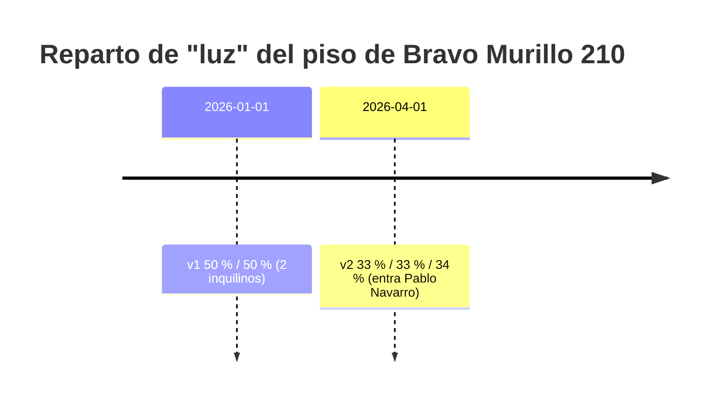

# 5 · Gastos y reparto

> Submódulo de [Inmuebles](01-inmuebles.md), en la pantalla **Gastos**. Registra
> las facturas de cada inmueble y, en los pisos compartidos, las reparte entre
> los inquilinos con un **% versionado por tipo de gasto**. Calcula además el
> **recibo individual** de cada factura y la **rentabilidad neta** del inmueble.

## Conceptos clave

| Concepto | Detalle |
|---|---|
| **Tipo de gasto** | `agua`, `luz`, `gas`, `internet`, `comunidad`, `ibi`, `seguro`, `mantenimiento`, `basuras`, `gestoria`, `otros`. |
| **Periodicidad** | `mensual`, `bimestral`, `trimestral`, `anual` — opcional (una factura puntual la deja vacía). |
| **Estado de pago** | Se guarda `pendiente` o `pagado`. `vencido` es **derivado** (`pendiente` + fecha de vencimiento pasada). Marcar `pagado` sin fecha de pago la sella con hoy. |
| **Reparto** | % por inquilino y tipo de gasto, con **vigencia**. No es un campo del inmueble: es una entidad versionada. |
| **Versión de reparto** | El conjunto de filas `(inmueble, tipo_gasto, vigente_desde)`. Cambiar el reparto crea una versión nueva y **cierra** la anterior (`vigente_hasta` = nuevo `vigente_desde`); la anterior no se borra. |
| **Recibo individual** | Dato derivado: reparte el importe de una factura entre los inquilinos según el % **vigente en la fecha de la factura**. |
| **Rentabilidad neta** | `ingresos (renta cobrada) − gastos (facturas emitidas)` de un mes, por inmueble. |
| **Cobro de renta** | Registro del ingreso mensual real (tabla propia, no la renta teórica del contrato). |

## Cómo funciona el reparto versionado



- Una factura de luz **emitida el 15/02/2026** se reparte con **v1** (50/50),
  aunque hoy esté vigente v2. El histórico no se reescribe.
- Una factura **emitida el 20/05/2026** se reparte con **v2** (33/33/34).
- Los porcentajes de un tipo de gasto en una misma versión **deben sumar 100 %**
  (con tolerancia para decimales tipo `33,33 + 33,33 + 33,34`). Si no, `400` y no
  se guarda.

### Redondeo del recibo (caso de referencia del plan)

`78,00 €` a `33 / 33 / 34 %` →

| Inquilino | % | Importe |
|---|---|---|
| Javier | 33 % | **25,74 €** |
| Ana | 33 % | **25,74 €** |
| Pablo | 34 % | **26,52 €** (absorbe el resto) |
| **Total** | 100 % | **78,00 €** exacto |

El redondeo se hace en céntimos y el último inquilino (por id) se lleva la
diferencia, de modo que la suma de las líneas **cuadra siempre al céntimo** con
el total.

Si el inmueble **no es compartido**, o no hay reparto vigente para ese tipo de
gasto en esa fecha, el recibo llega con `sinReparto: true` y sin líneas — es un
caso válido, no un error.

## Pantalla Gastos — `/gastos`

```
┌ Gastos    [ Inmueble: Bravo Murillo 210 · compartido ▾ ]  [ + Nuevo gasto ]┐
├───────────────────────────────────┬───────────────────────────────────────┤
│ FACTURAS DEL INMUEBLE             │ REPARTO VIGENTE           [Editar ▾]   │
│ ┌───────┬────────┬──────────┬───┐ │ ┌──────────┬──────┬──────┐             │
│ │ Luz   │ 78,00 €│ 30/09/26 │ ● │ │ │          │ Luz  │ Agua │             │
│ │ Agua  │ 42,00 €│ 05/10/26 │ ● │ │ │ Javier M.│ 33 % │ 50 % │             │
│ └───────┴────────┴──────────┴───┘ │ │ Ana B.   │ 33 % │ 50 % │             │
│                                   │ │ Pablo N. │ 34 % │  —   │             │
│ RECIBO INDIVIDUAL · Luz, sept.    │ │ Total    │100 % │100 % │             │
│  ● Javier M.  33 %      25,74 €   │ └──────────┴──────┴──────┘             │
│  ● Ana B.     33 %      25,74 €   │ Vigente desde 01/04/2026 —             │
│  ● Pablo N.   34 %      26,52 €   │  entrada de Pablo Navarro             │
│    Total repartido      78,00 €   │                                       │
│                                   │ RENTABILIDAD DEL INMUEBLE  [2026-09▾]  │
│                                   │  Ingresos (renta cobrada)  +1.350 €    │
│                                   │  Gastos del mes              −187 €    │
│                                   │  Neto                       1.163 €    │
│                                   │ COBROS DE RENTA          [ + Cobro ]   │
│                                   │  septiembre de 2026  transf.  1.350 €  │
└───────────────────────────────────┴───────────────────────────────────────┘
```

1. Elige el **inmueble** en el selector de la barra superior (por defecto, el
   primer compartido, o el primero).
2. **Nuevo gasto**: tipo e importe (> 0) y fecha de emisión son obligatorios.
   Marca «Ya está pagada» si procede.
3. Selecciona una factura de la lista → su **recibo individual** se recalcula.
4. **Editar reparto** (solo compartidos): crea una versión nueva; elige tipo de
   gasto, `vigente desde`, motivo y el % de cada inquilino (la suma tiene que dar
   100 %). El aviso bajo la matriz indica desde cuándo aplica.
5. **Rentabilidad**: elige el mes en el selector; ingresos − gastos del mes.
6. **+ Cobro**: registra el ingreso mensual de renta (mes, importe, fecha,
   método). La rentabilidad usa la renta **efectivamente cobrada**, no la teórica.
7. **Marcar pagada / pendiente**: botón por fila; al marcar pagada sin fecha, se
   sella con hoy.

## Reglas de negocio

| Situación | Resultado |
|---|---|
| `tipo` de gasto o `periodicidad` fuera de la lista | `400` |
| `importe` ≤ 0 o falta `fechaEmision` | `400` |
| Reparto cuyos % de un tipo de gasto no suman 100 | `400` — no se guarda |
| Reparto sin cuotas, sin `vigenteDesde`, o con un inquilino repetido | `400` |
| Cuota con inquilino inexistente o % fuera de `[0, 100]` | `400` |
| Cambiar el reparto | Crea versión nueva con `vigenteDesde`; la anterior se cierra, no se borra. |
| Factura anterior a un cambio de reparto | Se calcula con el reparto **vigente en su fecha**, no con el actual. |
| Suma de los recibos de una factura | Cuadra **exacta** con el importe total (redondeo repartido). |
| Gasto en inmueble no compartido | Se gestiona sin error; el recibo llega `sinReparto: true`. |
| Rentabilidad | `ingresos − gastos` del mes coincide con el cálculo manual sobre datos conocidos. |

## API

| Método y ruta | Cuerpo (campos relevantes) | Respuesta | Errores |
|---|---|---|---|
| `GET /api/inmuebles/{id}/gastos` | — | `Gasto[]` | `404` |
| `POST /api/inmuebles/{id}/gastos` | `tipo*`, `importe*`, `fechaEmision*`, `periodicidad`, `fechaVencimiento`, `proveedor`, `estadoPago`, `fechaPago`, `metodoPago` | `201` + `Gasto` | `400`, `404` |
| `GET /api/gastos/{id}` · `PUT /api/gastos/{id}` | (PUT: campos editables + `estadoPago`) | `Gasto` | `400`, `404` |
| `GET /api/gastos/{id}/recibo` | — | `Recibo` (`lineas[]` por inquilino, `sinReparto`) | `404` |
| `POST·GET /api/gastos/{id}/documentos` | `multipart/form-data`, campo `archivo` | `201` + `Documento` / `Documento[]` | `400`, `404` |
| `GET /api/inmuebles/{id}/reparto` | — | `{ versiones: VersionReparto[] }` (cada una con `vigente`, `cuotas[]`) | `404` |
| `POST /api/inmuebles/{id}/reparto` | `tipoGasto*`, `vigenteDesde*`, `motivo`, `cuotas*: [{inquilinoId, porcentaje}]` | `201` + reparto actualizado | `400` (no suman 100, cuota repetida, inquilino inexistente…), `404` |
| `GET /api/inmuebles/{id}/rentabilidad?periodo=AAAA-MM` | — | `{ periodo, ingresos, gastos, neto }` (mes en curso si se omite) | `400` periodo mal formado, `404` |
| `GET·POST /api/inmuebles/{id}/cobros` · `PUT /api/cobros/{id}` | `periodo*` (`AAAA-MM-01`), `importe*`, `fechaCobro`, `contratoId`, `metodoPago`, `notas` | `Cobro` | `400`, `404` |

`* = obligatorio`

## Preguntas frecuentes

- **¿Puedo tener repartos distintos para luz y para agua?** Sí: la vigencia y los
  porcentajes son por **tipo de gasto**. Cada `POST /reparto` afecta a un solo
  tipo.
- **¿Qué pasa si edito una factura y muevo su fecha de emisión a otro periodo de
  reparto?** El recibo se recalcula con el reparto vigente en la **nueva** fecha.
- **¿La rentabilidad suma la renta del contrato aunque no la haya cobrado?** No:
  usa solo los **cobros de renta** registrados. Es rentabilidad *neta real*.
