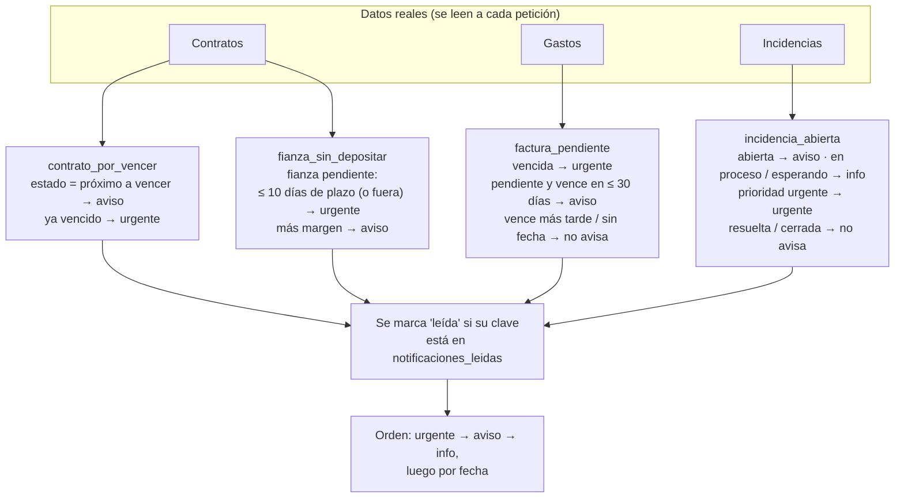
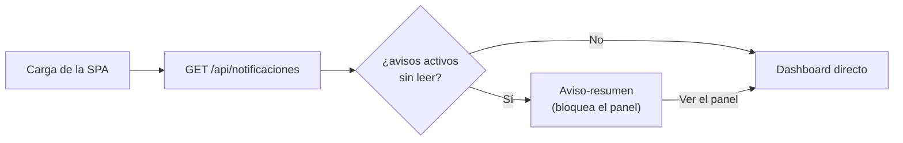

# 6 · Dashboard y centro de notificaciones

> El **Resumen** (pantalla de inicio, `/`) da la foto agregada de toda la
> cartera. El **Centro de notificaciones** (`/notificaciones`) evalúa cuatro
> reglas sobre los datos reales y lista los avisos activos. Al arrancar la
> aplicación, si hay avisos sin leer se muestra un **aviso-resumen** antes de
> dejar ver el panel.

**Todo es dato derivado en lectura.** No hay tabla de "avisos generados" ni
proceso en segundo plano: cada aviso y cada KPI se recalcula cruzando los repos
de los módulos anteriores en el momento de la petición. Lo único que se
persiste es **qué avisos ha marcado el usuario como leídos**.

## El Resumen — `/`

```
┌ Resumen ───────────────────────────────────────────────────────────┐
│ ⚠ 3 avisos requieren tu atención.                        Revisar → │
├──────────────┬──────────────┬──────────────┬──────────────────────┤
│ Ocupación    │ Contratos    │ Gastos       │ Rentabilidad del mes │
│   4 / 5      │ por vencer   │ pendientes   │      +2340 €          │
│ inmuebles    │      1       │   113 €      │ ingresos − gastos,   │
│ ocupados·80 %│ próx. 60 días│ 2 facturas   │ agosto               │
├──────────────┴──────────────┴─────┬────────┴──────────────────────┤
│ TU CARTERA          Ver todos →   │ CENTRO DE NOTIFICAC. Ver (3) → │
│  Alcalá 145   ● Alquilado  980 €  │ ● Fianza sin depositar —      │
│  Bravo M. 210 2/3 · 67 %  1.350 € │   Embajadores 58 …            │
│  …                                │ ● Contrato próximo a vencer … │
└───────────────────────────────────┴───────────────────────────────┘
```

| KPI | Cómo se calcula |
|---|---|
| **Ocupación** | Inmuebles ocupados ÷ totales. Un inmueble cuenta como ocupado si **no es compartido y está `alquilado`**, o si **es compartido y tiene ≥1 habitación con contrato vigente**. |
| **Contratos por vencer** | Nº de contratos cuyo estado derivado es `proximo_a_vencer` (fin dentro de 60 días). |
| **Gastos pendientes** | Nº e importe de facturas cuyo estado de pago derivado **no** es `pagado` (pendientes + vencidas). |
| **Rentabilidad del mes** | `Σ ingresos − Σ gastos` de **toda la cartera** en el mes en curso (o `?periodo=AAAA-MM`). |
| **Notificaciones sin leer** | Nº de avisos activos que el usuario no ha marcado como leídos. |

La tabla **Tu cartera** y el panel **Centro de notificaciones** son listados de
apoyo; los números que cuentan vienen del endpoint del resumen.

## Las cuatro reglas de notificación



| Regla (`tipo`) | Se dispara cuando… | Severidad |
|---|---|---|
| `contrato_por_vencer` | El contrato está `proximo_a_vencer` (fin ≤ hoy + 60 d). Si ya está `vencido`, sube a urgente. Un contrato `rescindido` nunca avisa. | `aviso` / `urgente` |
| `fianza_sin_depositar` | La fianza sigue `pendiente` y el contrato no está rescindido. **≤ 10 días** para el fin del plazo legal de 30 (o ya fuera de plazo) → `urgente`; más margen → `aviso`. | `aviso` / `urgente` |
| `factura_pendiente` | La factura no está pagada y tiene fecha de vencimiento. Ya **vencida** → `urgente`; **pendiente** con vencimiento en ≤ 30 días → `aviso`. Sin fecha de vencimiento, o vence más tarde → no genera aviso. | `aviso` / `urgente` |
| `incidencia_abierta` | La incidencia está `abierta`, `en_proceso` o `esperando_proveedor`. `abierta` → `aviso`; ya en gestión → `info`; **prioridad `urgente`** → `urgente`. `resuelta`/`cerrada` → no avisa. | `info` / `aviso` / `urgente` |

### Umbrales (constantes justificadas en el código)

| Constante | Valor | Razón |
|---|---|---|
| `DiasAvisoVencimiento` | 60 | Ventana de la LAU/negocio para el preaviso de vencimiento. |
| `DiasFianzaUrgente` | 10 | Último tercio del plazo legal de 30 días: con ≤ 10 días de margen queda poco tiempo real de reacción. |
| `DiasFacturaAviso` | 30 | Una factura pendiente que vence más allá de un mes todavía no es accionable; no satura el centro. |

## El identificador de cada aviso: la `clave`

Cada aviso tiene una identidad **determinista y estable**:

```
"<tipo>:<entidad>:<id>"      p. ej.   contrato_por_vencer:contrato:5
                                       fianza_sin_depositar:contrato:5
                                       factura_pendiente:gasto:12
                                       incidencia_abierta:incidencia:3
```

- No cambia entre reinicios ⇒ marcar un aviso como leído **persiste**.
- Fianza y vencimiento del **mismo** contrato tienen claves distintas (distinto
  `tipo`) ⇒ se marcan por separado.
- **Cuando la condición desaparece y reaparece:** la fila "leída" está keyed por
  la clave y se conserva. Si un contrato se renueva deja de avisar; si más
  adelante vuelve a entrar en la ventana, la **misma clave** lo reencuentra ya
  leído. Un aviso sobre una entidad **nueva** (p. ej. otra factura impagada)
  tiene otra `id` → otra clave → vuelve a contar.
- **El contador del Resumen siempre refleja el nº real de condiciones activas**,
  estén leídas o no.

## El Centro de notificaciones — `/notificaciones`

```
┌ Notificaciones   [Todas·3] [Urgentes·1] [Avisos·2] [Info·0]   [Marcar todas como leídas]┐
│ URGENTE                                                                                 │
│  🔺 Fianza sin depositar                                              [ URGENTE ]       │
│     Embajadores 58, 1ºC — Plazo legal de 30 días… Fecha límite: 04/09/2026 (en 5 días). │
│     04/09/2026 · en 5 días   Ver contrato →   Marcar como leída                         │
│ AVISO                                                                                   │
│  📅 Contrato próximo a vencer                                          [ AVISO ]        │
│     Bravo Murillo 210 — Vence el 05/10/2026 (en 36 días).                               │
│     …                                                                Leída              │
└────────────────────────────────────────────────────────────────────────────────────────┘
```

1. Los avisos se agrupan por **severidad** (Urgente → Aviso → Info) y, dentro de
   cada grupo, se ordenan por fecha.
2. Los **chips** cuentan los avisos activos **sin leer**; filtran la lista.
3. **Marcar como leída** llama a la API y **actualiza el contador al instante**,
   sin recargar la página; la fila queda atenuada con la etiqueta "Leída".
4. **Marcar todas como leídas** hace lo mismo con todos los pendientes.
5. El **badge del rail** (junto a "🔔 Notificaciones") muestra el total sin leer y
   baja en vivo al marcar avisos.

## El aviso-resumen al arrancar



- Es un componente-guard que envuelve la pantalla Resumen. Al cargar la SPA
  consulta `GET /api/notificaciones`; si hay avisos sin leer, muestra el
  resumen (nº total, cuántos urgentes, los primeros 6) y **no deja ver el
  dashboard** hasta pulsar **«Ver el panel»**.
- Sin avisos sin leer, entra directo.
- Bloquea **una vez por arranque** (carga completa de la SPA). Navegar por la
  app después no lo vuelve a interponer; recargar el navegador entero cuenta
  como un arranque nuevo.

## API

| Método y ruta | Respuesta | Notas |
|---|---|---|
| `GET /api/dashboard/resumen?periodo=AAAA-MM` | `{ periodo, ocupacion{...}, contratosPorVencer, gastosPendientes{cantidad, importe}, incidenciasAbiertas, rentabilidad{ingresos, gastos, neto}, notificacionesSinLeer }` | Sin `periodo`, usa el mes en curso. Todo recalculado al leer. |
| `GET /api/notificaciones` | `{ notificaciones: Notificacion[], totalActivas, totalSinLeer }` | Incluye los avisos ya leídos (con `leida: true`), ordenados por severidad y fecha. |
| `POST /api/notificaciones/{id}/leida` | `{ clave, leida: true }` | `{id}` = la `clave`. Idempotente. **No toca el dato de fondo.** Clave mal formada → `400`. |

Forma de `Notificacion`:
`{ clave, tipo, severidad, titulo, descripcion, entidadTipo, entidadId, inmuebleId, fecha, leida }`.

## Reglas de negocio

| Situación | Resultado |
|---|---|
| Contrato dentro de la ventana de aviso | Genera `contrato_por_vencer`. |
| Fianza pendiente con poco plazo / con margen | `urgente` / `aviso` respectivamente. |
| Marcar un aviso como leído | Sale del contador de "sin leer"; `totalActivas` no cambia; **el contrato sigue `proximo_a_vencer`**. |
| Persistencia | La marca "leída" sobrevive a reiniciar el proceso (tabla `notificaciones_leidas`, migración `0007`). |
| Sin avisos activos sin leer | La app entra directa al dashboard, sin aviso-resumen. |
| Con avisos sin leer | El aviso-resumen aparece antes del resto del dashboard. |
| Números del resumen | Se recalculan sobre los datos reales (añadir un gasto cambia el KPI en la siguiente lectura). |

## Preguntas frecuentes

- **Marqué un aviso como leído por error.** No hay "desmarcar" en la GUI, pero el
  KPI del Resumen sigue contando la condición real; el aviso volverá a contar si
  se resuelve y reaparece sobre una entidad nueva.
- **¿Puedo cambiar los umbrales (10 días, 30 días, 60 días)?** Son constantes en
  `internal/domain/` (`DiasFianzaUrgente`, `DiasFacturaAviso`,
  `DiasAvisoVencimiento`); hay que recompilar.
- **El aviso-resumen no aparece aunque hay avisos.** Solo bloquea una vez por
  carga completa de la SPA. Recarga el navegador para volver a verlo.
