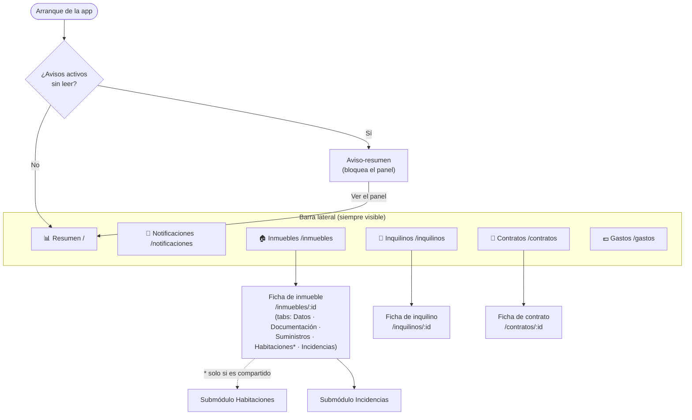
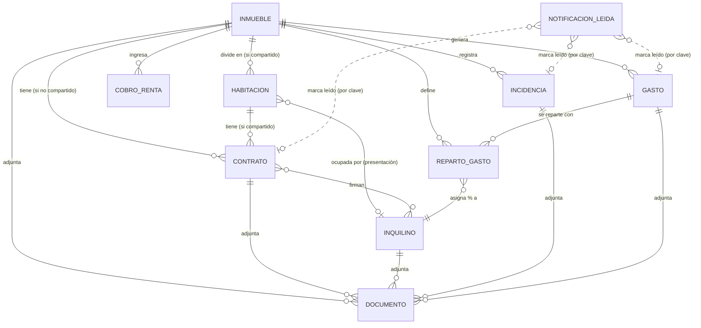

# Manual funcional — Arantxator Flat Admin

**v1.0-alpha** · Documentación de uso de cada módulo, pensada para leerse rápido.

Arantxator Flat Admin es una aplicación de escritorio (un único `.exe` que abre
el navegador) para que **una persona** gestione **su** cartera de alquileres:
inmuebles, inquilinos, contratos, incidencias, gastos y un panel de resumen con
avisos. Todo local, sin cuentas ni conexión a internet.

## Índice

| # | Módulo | Qué resuelve |
|---|--------|--------------|
| 1 | [Inmuebles](01-inmuebles.md) | Ficha de cada propiedad, documentación, suministros y —si es compartido— sus habitaciones |
| 2 | [Inquilinos](02-inquilinos.md) | Ficha de cada inquilino, documentación, IBAN y su histórico de contratos |
| 3 | [Contratos](03-contratos.md) | Arrendamientos con las reglas de la LAU (Madrid): duración, fianza, IRAV, estado derivado |
| 4 | [Incidencias](04-incidencias.md) | Partes de mantenimiento por inmueble, con flujo de estados fechado y coste |
| 5 | [Gastos y reparto](05-gastos-y-reparto.md) | Facturas, reparto porcentual versionado entre inquilinos, recibo individual y rentabilidad neta |
| 6 | [Dashboard y notificaciones](06-dashboard-y-notificaciones.md) | Resumen agregado de la cartera + centro de avisos, con aviso-resumen al arrancar |

> Para instalar, compilar o desplegar: [`../../README.md`](../../README.md) y
> [`../despliegue/instalacion-despliegue.md`](../despliegue/instalacion-despliegue.md).
> Para el análisis de requisitos y las decisiones de diseño:
> [`../design/diseno-tecnico-funcional.md`](../design/diseno-tecnico-funcional.md).
> Para el estado de cada hito: [`../plan/plan-implementacion.md`](../plan/plan-implementacion.md).

## Mapa de navegación de la aplicación

## Conceptos que se repiten en todos los módulos

### 1. Dato guardado vs. dato derivado

La aplicación guarda **lo mínimo** y calcula el resto **al leer**, siempre sobre
los datos reales del momento. Nunca hay una cifra "congelada" de otro momento.

| Se guarda en la base de datos | Se calcula al leer (no se guarda) |
|---|---|
| Fechas de un contrato, importe de la fianza, su estado (`pendiente`/`depositada`…) | **Estado del contrato** (`activo` / `próximo a vencer` / `vencido`), **fecha límite de la fianza** (= firma + 30 días) |
| Importe y fecha de una factura, `pendiente`/`pagado` | **Estado de pago derivado** (`vencido` = pendiente + vencido) |
| % de reparto por inquilino y tipo de gasto, con su fecha de vigencia | **Recibo individual** de cada factura (reparte el importe al céntimo) |
| Habitaciones de un inmueble compartido, contratos por habitación | **% de ocupación** del inmueble (habitaciones con contrato vigente ÷ total) |
| Qué avisos ha marcado el usuario como leídos | **Los avisos en sí** y **todos los KPIs del resumen** |

Consecuencia práctica: marcar un aviso como leído **no cambia el dato de fondo**
(el contrato sigue "próximo a vencer"); solo lo retira del contador.

### 2. Fechas

- Los campos de **solo fecha** (firma de contrato, emisión de factura, fecha de
  nacimiento…) viajan siempre como `AAAA-MM-DD`, lo que produce un
  `<input type="date">`.
- Los campos de **fecha y hora** (creado/actualizado, apertura/cierre de
  incidencia) son marcas de tiempo internas.

### 3. Documentos adjuntos

Cualquier adjunto (contrato firmado, factura en PDF, foto, DNI…) se guarda como
**BLOB dentro de la propia base de datos**, no como fichero suelto. Por eso la
copia de seguridad de toda la aplicación es **copiar un único fichero**
(`arantxator.db`). El mecanismo es el mismo en Inmuebles, Inquilinos, Contratos,
Incidencias y Gastos: `POST …/documentos` para subir, `GET /api/documentos/{id}`
para descargar.

### 4. Inmueble normal vs. inmueble compartido

| | Inmueble **no compartido** | Inmueble **compartido** (por habitaciones) |
|---|---|---|
| Unidad de alquiler | El inmueble completo | Cada **habitación** por separado |
| Contrato | 1 contrato del inmueble (`habitacionId` nulo) | 1 contrato **por habitación** (`habitacionId` obligatorio) |
| Contratos activos a la vez | Uno como máximo | Uno por habitación (varios simultáneos) |
| `Estado` del inmueble | Automático: `alquilado` / `disponible` según el contrato | A mano; se muestra además un **% de ocupación** |
| Reparto de gastos | No aplica (los gastos no se reparten) | % por inquilino y tipo de gasto, versionado |

## Modelo de datos (resumen)

## Todos los endpoints de la API

La SPA es la única consumidora. Base: `http://127.0.0.1:8080/api`. Todas las
respuestas son JSON `camelCase`; los errores son `{"error": "mensaje"}` con el
código HTTP correspondiente (`400` validación, `404` no encontrado, `409`
conflicto de reglas, `500` error interno).

| Módulo | Método y ruta | Para qué |
|--------|---------------|----------|
| Salud | `GET /health` | Comprobación de vida (`{"status":"ok"}`) |
| Inmuebles | `GET /inmuebles` · `POST /inmuebles` | Listar (filtro `?estado=`) / crear |
| Inmuebles | `GET /inmuebles/{id}` · `PUT /inmuebles/{id}` | Ver / editar (incluye `ocupacion` si es compartido) |
| Inmuebles | `POST /inmuebles/{id}/documentos` · `GET /inmuebles/{id}/documentos` | Subir / listar adjuntos |
| Documentos | `GET /documentos/{id}` | Descargar un adjunto (cualquier módulo) |
| Habitaciones | `GET·POST /inmuebles/{id}/habitaciones` | Listar / crear habitación (inmueble compartido) |
| Habitaciones | `GET·PUT·DELETE /habitaciones/{id}` | Ver / editar / borrar |
| Habitaciones | `PUT /habitaciones/{id}/ocupante` | Asignar o quitar (`inquilinoId: null`) el ocupante |
| Inquilinos | `GET·POST /inquilinos` · `GET·PUT /inquilinos/{id}` | CRUD de inquilinos |
| Inquilinos | `POST·GET /inquilinos/{id}/documentos` | Subir / listar adjuntos |
| Inquilinos | `GET /inquilinos/{id}/contratos` | Histórico de contratos del inquilino |
| Contratos | `GET·POST /contratos` · `GET·PUT /contratos/{id}` | CRUD de contratos |
| Contratos | `POST·GET /contratos/{id}/documentos` | Subir / listar el PDF firmado y anexos |
| Incidencias | `GET·POST /inmuebles/{id}/incidencias` | Listar / crear incidencia del inmueble |
| Incidencias | `GET·PUT /incidencias/{id}` | Ver / editar (cambio de estado, comentario) |
| Incidencias | `POST·GET /incidencias/{id}/documentos` | Subir / listar fotos y facturas |
| Gastos | `GET·POST /inmuebles/{id}/gastos` · `GET·PUT /gastos/{id}` | CRUD de facturas |
| Gastos | `GET /gastos/{id}/recibo` | Recibo individual (reparto por inquilino) |
| Gastos | `POST·GET /gastos/{id}/documentos` | Subir / listar el PDF de la factura |
| Reparto | `GET·POST /inmuebles/{id}/reparto` | Ver versiones / crear una versión nueva del reparto |
| Rentabilidad | `GET /inmuebles/{id}/rentabilidad?periodo=AAAA-MM` | Ingresos − gastos del mes para ese inmueble |
| Cobros | `GET·POST /inmuebles/{id}/cobros` · `PUT /cobros/{id}` | Registrar el cobro mensual de renta |
| Dashboard | `GET /dashboard/resumen?periodo=AAAA-MM` | KPIs agregados de toda la cartera |
| Notificaciones | `GET /notificaciones` | Lista de avisos activos + contador sin leer |
| Notificaciones | `POST /notificaciones/{id}/leida` | Marcar un aviso como leído (`{id}` = clave determinista) |

## Glosario

| Término | Significado |
|---|---|
| **Cartera** | El conjunto de todos los inmuebles/inquilinos/contratos de la única persona usuaria (mono-cartera). |
| **Compartido** | Inmueble que se alquila por habitaciones, cada una con su propio contrato. |
| **Estado derivado** | Valor calculado al leer a partir de las fechas y otros datos, no guardado (estado del contrato, estado de pago de una factura…). |
| **Ventana de aviso** | 60 días naturales antes del fin de un contrato: dentro de ella pasa a "próximo a vencer". |
| **Vigencia de un reparto** | Intervalo `[vigente_desde, vigente_hasta)` de una versión del reparto; cambiar el reparto crea una versión nueva, no borra la anterior. |
| **Recibo individual** | Desglose por inquilino de lo que le toca pagar de una factura concreta, calculado al vuelo. |
| **Clave de notificación** | Identidad estable de un aviso: `"<tipo>:<entidad>:<id>"` (p. ej. `contrato_por_vencer:contrato:5`). |
| **IRAV** | Índice de Referencia de Actualización de la Vivienda (INE), referencia legal de subida de renta desde 2025. |
| **Agencia de Vivienda Social** | Organismo de la Comunidad de Madrid donde se deposita la fianza (antiguo IVIMA), plazo de 30 días. |
